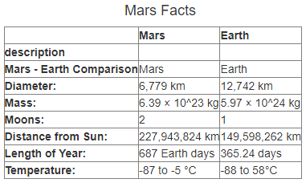

# Mission-to-Mars

## Resources

Python 3.7.9, Pandas, Splinter, Beautiful Soup, Chrome Web Drivervs code 1.54, mongoDB 4.4.4, Flask 1.1.2, PyMongo

## Project Overview

The purpose of this project was to scrape the NASA webpage for the latest news and images of Mars.  I wrote a python script incorporating splinter to browse the website, and beautiful soup to scrape the html for the most recent article title and summary, as well as the url of the featured image and facts about the planet.  I first developed the code for that script in the Mission_to_Mars_scraping.ipynb file, then downloaded that to the Mission_to_Mars.py file, and finally incorporated it into the full script in the scraping.py file.  I then created a Flask app to run the python script and store the scraping results in a mongo database and create a webpage to display article title and summary, the image, and the facts table.  Finally, I incorporated a button on the webpage that re-runs the python script to scrape for a new article to display.  That code to create the flask app is in the app.py file, and the webpage code is in the index.html file in the templates folder.

Below are samples of the image, facts table, and button as they appear on the webpage:

Featured Image:

Facts Table:

Update Button:

